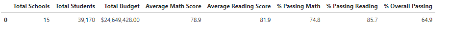
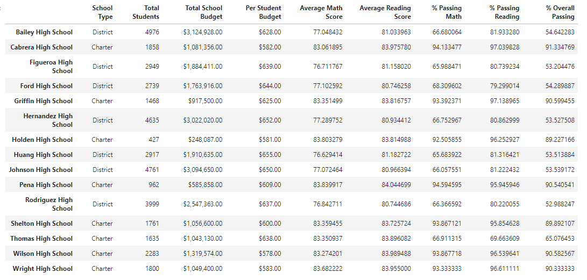

# School_District_Analysis

## Purpose
The purpose of this report is to analyze the variations in the data from the   ***students_complete.csv***   file once  all the marks for the math and reading scores for Thomas High School are replaced  with NaNs while keeping the rest of the data intact. 

## Results

### District summary 

### School summary

## Summary
